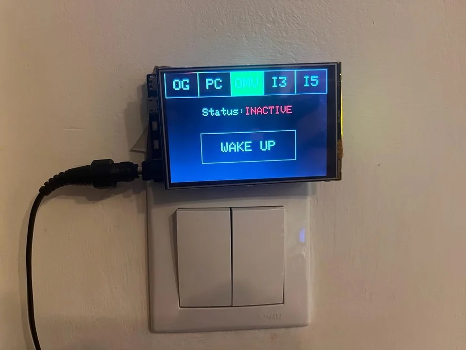
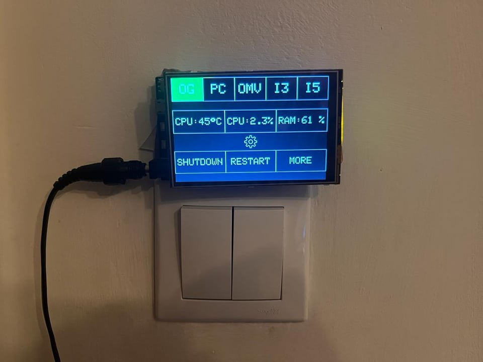

# Devices Console

A wall-mounted touchscreen "home console" for monitoring and controlling the family of always-on PCs, NAS boxes, and mini-PCs around the house. The console was originally built in 2023 (before I started college) as a personal automation project using Arduino hardware plus a lightweight Python web service on each managed device.

## What it does
- Displays per-device CPU temperature, CPU usage, and RAM usage pulled from small Python web services running on each machine.
- Sends Wake-on-LAN (WOL) requests to power on devices remotely.
- Triggers remote shutdowns and reboots through simple HTTP endpoints.
- Provides a tactile TFT touchscreen UI with a navigation bar for multiple hosts (e.g., OG, PC, OMV, NUC-I3, NUC-I5).

## Hardware used
- **CH340G-based Arduino with Wi-Fi** (ESP8266 HTTP client companion) for networking and serial comms.
- **UNO-compatible board with TFT touchscreen shield** for the UI (`ARDUINO/UNO_TOUCHSCREEN_DEVICES_CONSOLE`).
- Standard desktop/mini-PCs and NAS boxes running lightweight Python web servers.

## Repository layout
- `ARDUINO/UNO_TOUCHSCREEN_DEVICES_CONSOLE/` – Arduino firmware for the TFT interface, touch handling, and serial protocol to the Wi-Fi module.
- `ARDUINO/ESP8266_HTTP_CLIENT_PC/` – ESP8266 client that bridges serial commands to HTTP requests (for device stats/actions).
- `PYTHON/REMOTE-PC-WEB-STATS-*` – Flask-based web servers that expose system stats plus `/shutdown` and `/reboot` endpoints for each device flavor.

## Arduino firmware quickstart
1. Open `ARDUINO/UNO_TOUCHSCREEN_DEVICES_CONSOLE/UNO_TOUCHSCREEN_DEVICES_CONSOLE.ino` in the Arduino IDE.
2. Install the TFT and touch libraries referenced in `tft_screen_display.h` and `tft_screen_touch.h` (common ILI9341/TouchScreen stacks).
3. Flash the sketch to the UNO-compatible board and connect the ESP8266 serial bridge. The UI uses the navigation bar to select a host and highlights actions while requests are in-flight.

## Device web service setup (Linux example)
Each device hosts a tiny Flask app that the console queries.

1. Navigate to `PYTHON/REMOTE-PC-WEB-STATS-LINUX/` on the target machine.
2. Create a virtual environment and install dependencies:
   ```bash
   python -m venv .venv
   source .venv/bin/activate
   pip install -r requirements.txt
   ```
3. Run the service:
   ```bash
   FLASK_APP=main.py flask run --host 0.0.0.0 --port 5000
   ```
   Or use `gunicorn`/`gevent` for a production-style server.
4. Optional: install `python-device-control-server.service` as a systemd unit to auto-start on boot.

### API surface
- `GET /stats` → JSON payload with `cpu_temp`, `cpu_usage`, and `memory_usage` (see `main.py` for psutil-based implementation).
- `GET /shutdown` → executes `shutdown now` on the host.
- `GET /reboot` → executes `reboot now` on the host.

## Using the console
- Tap a navigation button (OG, PC, OMV, NUC-I3, NUC-I5) to select a device.
- The status banner flips between **INACTIVE** and live stats once the device responds.
- Use **WAKE UP** to send WOL packets via the Wi-Fi client, or choose **SHUTDOWN** / **RESTART** while a device is active.
- The UI automatically resets button highlights after a short timeout to avoid accidental repeats.

## Project photos
A quick look at the mounted console:
  

  

## Related projects
- [cosmin1805/WOL-WEB-INTERFACE](https://github.com/cosmin1805/WOL-WEB-INTERFACE) – a broader web interface for the same types of monitoring and control tasks (wake, shutdown, reboot, stats) from a browser.

## Notes
- Built in 2023 before starting college; kept here as a snapshot of the original build.
- The Python services assume access to `psutil` sensor data; adjust the `/stats` implementation if your platform exposes temperatures differently.
- Extend the Arduino navigation bar arrays to add more hosts, and update the ESP8266 client to point at the corresponding IPs.
